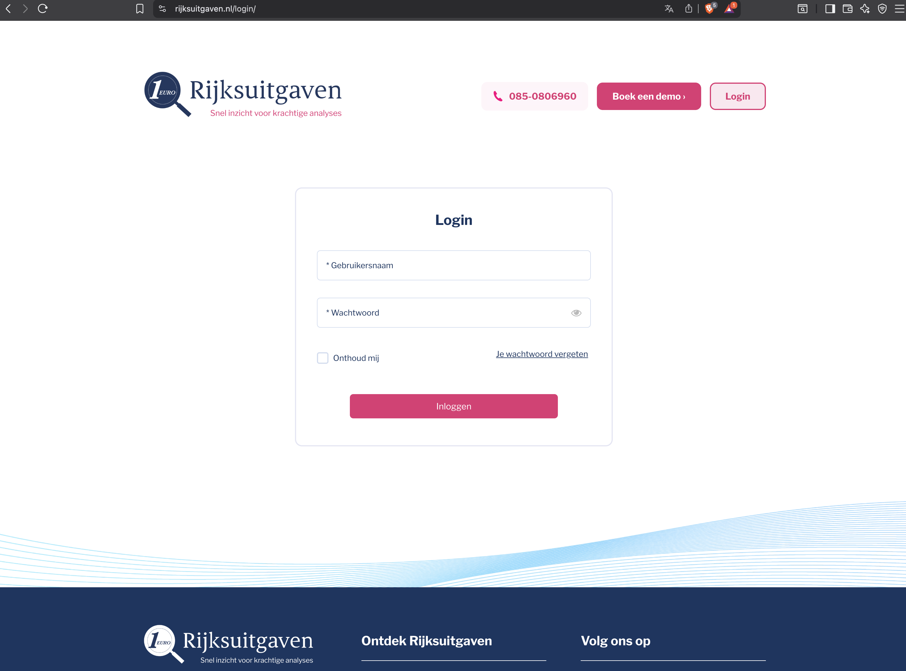
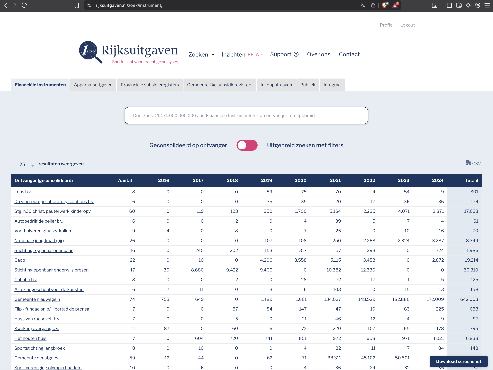
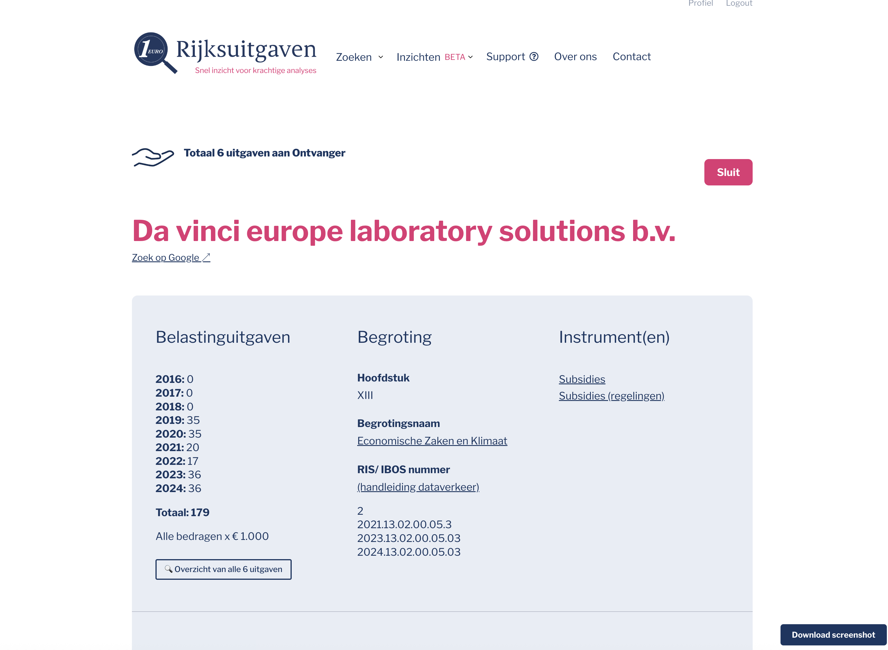
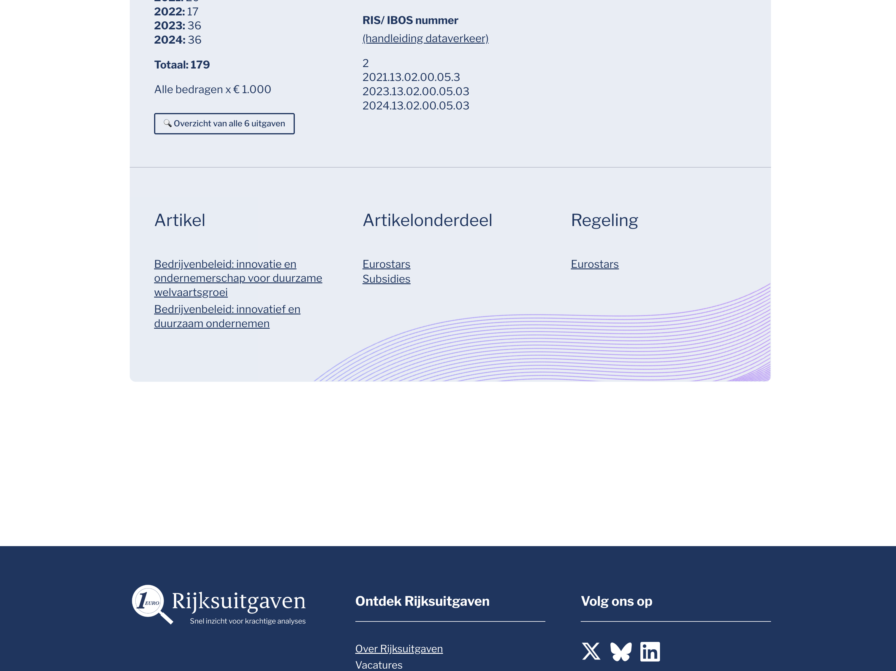
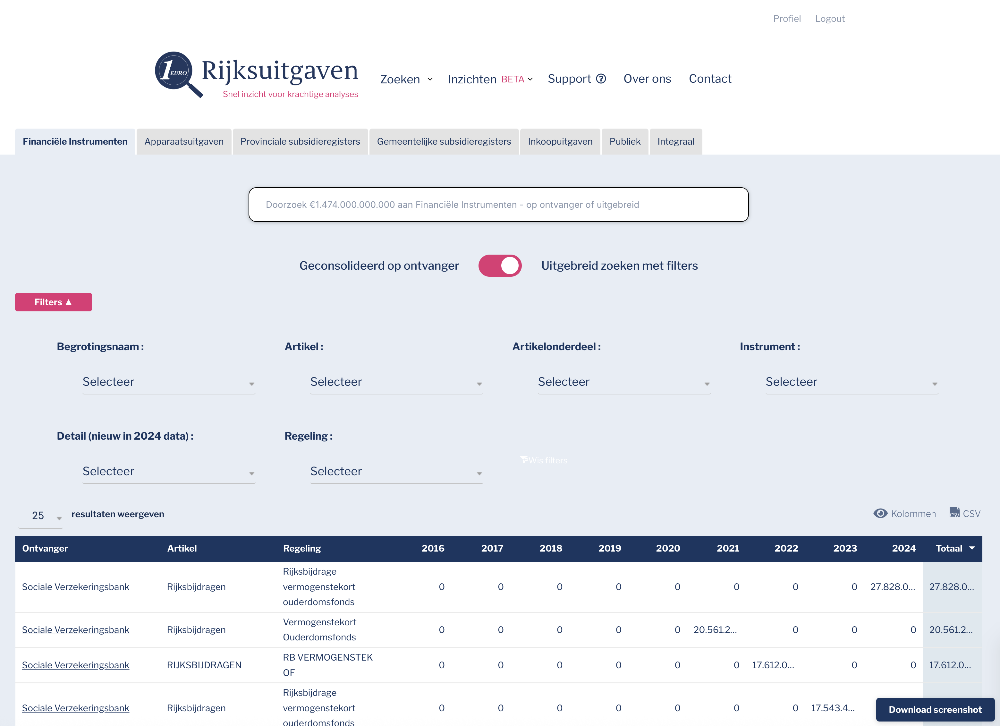

# Current UI Overview

## Platform Overview
Rijksuitgaven.nl is a financial data analysis platform providing insights into Dutch government financial instruments and expenditures. The tagline "Snelrecht voor krachtige analyses" (Fast access to powerful analyses) reflects its purpose as a research and analysis tool.

## Screenshots Inventory

### 1. Login Page
**File:** `01-login.png`



**Key Features:**
- Clean, centered login form
- Username and password fields
- "Remember me" checkbox
- "Forgot password" link ("Ik wachtwoord vergeten")
- Primary CTA button "Inloggen" (Login)
- Top navigation shows "Boek een demo" (Book a demo) and "Login" buttons
- Contact phone number displayed
- Brand logo with tagline

**Design Elements:**
- Pink/magenta primary color (#E91E63 or similar)
- Navy blue footer
- Light blue decorative wave pattern at bottom
- Minimalist, professional design
- Responsive layout

---

### 2. Financial Instruments Module - Consolidated View
**File:** `02-Module-Financiele Instrumenten-Geconsolideerd.png`



**Key Features:**
- **Navigation Tabs:**
  - Financiële Instrumenten (active)
  - Apparaatuitgaven
  - Provinciale subsidieregisters
  - Gemeentelijke subsidieregisters
  - Inkoopuitgaven
  - Publiek
  - Integraal

- **Search Functionality:**
  - Large search bar with placeholder text
  - "Geconsolideerd op ontvanger" toggle (Consolidated by recipient)
  - "Uitgebreid zoeken met filters" option (Advanced search with filters)

- **Data Table:**
  - Multi-year comparison (2015-2024)
  - Rows for different recipients/organizations
  - "Totaal" (Total) column on the right
  - Numerical data showing financial amounts
  - Expandable rows (indicated by arrows)
  - "Download screenshot" button in bottom right

- **Top Navigation:**
  - Zoeken (Search) with dropdown
  - Inzichten BETA (Insights)
  - Support with help icon
  - Over ons (About us)
  - Contact
  - Profile/Logout in top right

**Design Elements:**
- Data-dense table layout
- Clean typography
- Pink accent for toggles
- Subtle row highlighting
- Professional color scheme

---

### 3. Detail Page - Part 1
**File:** `02-Module-Financiele Instrumenten-Geconsolideerd-Detail pagina-deel 01.png`



**Key Features:**
- **Page Header:**
  - "Totaal 6 uitgaven aan Ontvanger" (Total 6 expenditures to Recipient)
  - Company name: "Da vinci europe laboratory solutions b.v."
  - "Zoek op Google" link (Search on Google)
  - "Sluit" button (Close)

- **Three-Column Layout:**
  1. **Belastinguitgaven (Tax expenditures):**
     - Year-by-year breakdown (2016-2024)
     - Total: 179
     - "Alle bedragen x €1.000" note
     - "Overzicht van alle 6 uitgaven" button (Overview of all 6 expenditures)

  2. **Begroting (Budget):**
     - Hoofdstuk (Chapter): XIII
     - Begrotingsnaam (Budget name): Economische Zaken en Klimaat
     - RIS/IBOS nummer with link to data provider

  3. **Instrument(en) (Instruments):**
     - Subsidies (Grants)
     - Subsidies (regelingen) with link

**Design Elements:**
- Tabs-like organization
- Light gray background sections
- Clean information hierarchy
- Navy blue "Download screenshot" button

---

### 4. Detail Page - Part 2
**File:** `02-Module-Financiele Instrumenten-Geconsolideerd-Detail pagina-deel 02.png`



**Key Features:**
- Continuation of detail page showing:
  - **Artikel (Article):** Related policy documents
  - **Artikelonderdeel (Article section):** Subdivisions with links
  - **Regeling (Regulation):** Eurostars reference

- **Footer Section:**
  - Dark navy blue background
  - "Ontdek Rijksuitgaven" (Discover Rijksuitgaven) section
  - "Volg ons op" (Follow us on) with social media icons:
    - X (Twitter)
    - Bluesky
    - LinkedIn

**Design Elements:**
- Consistent with overall design
- Light purple decorative wave pattern
- Professional footer layout
- Social media integration

---

### 5. Advanced Search View
**File:** `03-Module-Financiele Instrumenten-Uitgebreid zoeken.png`



**Key Features:**
- **Search Interface:**
  - Same navigation tabs as consolidated view
  - Large search bar
  - "Geconsolideerd op ontvanger" toggle
  - "Uitgebreid zoeken met filters" active

- **Filter Panel:**
  - "Filters ▲" expandable section (pink badge)
  - Four filter dropdowns:
    1. Begrotingsnaam (Budget name)
    2. Artikel (Article)
    3. Artikelonderdeel (Article section)
    4. Instrument (Instrument)
  - Additional filters:
    - Detail (nieuw in 2024 data)
    - Regeling (Regulation)
  - "25 resultaten weergeven" (Show 25 results) selector
  - "Kolommen" (Columns) and "CSV" export options

- **Results Table:**
  - Columns: Ontvanger, Artikel, Regeling, 2016-2024, Totaal
  - Expandable rows
  - Year-by-year financial data
  - "Download screenshot" button

**Design Elements:**
- Comprehensive filtering system
- Data export capabilities
- Flexible column display
- Consistent table design with main view

---

## UI Patterns & Components

### Navigation
- **Top Bar:** Logo, main navigation, profile/logout
- **Tab Navigation:** Module switcher
- **Breadcrumbs:** Implicit through page titles

### Data Display
- **Tables:** Primary data visualization method
- **Multi-year comparison:** Standard layout
- **Expandable rows:** For detailed information
- **Detail pages:** Multi-section information display

### Interactive Elements
- **Toggles:** Pink/magenta color
- **Dropdowns:** For filtering and selection
- **Buttons:**
  - Primary: Pink/magenta (CTA actions)
  - Secondary: Navy blue (downloads)
  - Tertiary: Text links
- **Search:** Prominent search bar with advanced options

### Colors
- **Primary:** Pink/Magenta (#E91E63 or similar)
- **Secondary:** Navy Blue (#2C3E50 or similar)
- **Accent:** Light blue (decorative elements)
- **Background:** White with light gray sections
- **Text:** Dark gray/black

### Typography
- **Headings:** Bold, clear hierarchy
- **Body:** Clean sans-serif
- **Data:** Monospace-like for numbers
- **Links:** Underlined, blue

### Layout
- **Responsive:** Adapts to screen size
- **White space:** Good use of padding
- **Card-based:** For information grouping
- **Full-width tables:** For data display

---

## User Flows Observed

### 1. Search & Discover Flow
1. Land on search page with tabs
2. Enter search query or use filters
3. Toggle consolidation options
4. View results in table
5. Click row to see detail page

### 2. Detail View Flow
1. View recipient/organization overview
2. See multi-year data breakdown
3. Access budget and instrument information
4. View related articles and regulations
5. Download screenshot or export data

### 3. Advanced Search Flow
1. Click "Uitgebreid zoeken met filters"
2. Open filter panel
3. Select filters from dropdowns
4. Adjust result count
5. Export to CSV if needed

---

## Key Observations

### Strengths
- Clean, professional design
- Data-dense but readable
- Good use of filters for complex data
- Multi-year comparison is intuitive
- Export functionality present
- Consistent design language

### Potential Improvements
- Mobile responsiveness unclear from screenshots
- Table could benefit from sorting indicators
- Search could show more context/suggestions
- Detail page could be more visually engaging
- No visible "favorites" or "save search" functionality
- Limited data visualization (charts, graphs)

### Technical Observations
- Beta features indicated ("Inzichten BETA")
- Support system in place (Support icon)
- Integration with external sources (Google search, RIS/IBOS)
- Screenshot download functionality (suggests reporting use case)
- Social media presence

---

## Content Types

### Primary Data
- Financial expenditures by year
- Recipient/organization information
- Budget categories (Begrotingen)
- Instruments (Subsidies, etc.)
- Articles and regulations
- RIS/IBOS reference numbers

### Metadata
- Years (2015-2024 visible)
- Chapters (Hoofdstukken)
- Budget names
- Subsidy schemes
- Policy articles

---

## Access & Authentication
- Login required for access
- Demo booking available
- Contact phone number provided
- Profile management implied
- Session management ("Remember me")

---

## Integration Points
- Google search integration
- RIS/IBOS data provider
- Data export (CSV)
- Screenshot generation
- Social media links

---

## Two-View Toggle Pattern (Critical for Port)

The core UI pattern across all modules is a toggle between two views, each backed by different SQL tables.

### Toggle States

| Toggle State | Dutch Label | SQL Table Pattern |
|--------------|-------------|-------------------|
| **Consolidated** | "Geconsolideerd op ontvanger" | `*_pivot_geconsolideerd` |
| **Extended/Filtered** | "Uitgebreid zoeken met filters" | `*_pivot` |

### SQL Table Mappings Per Module

| Module | Consolidated Table | Detail Table |
|--------|-------------------|--------------|
| Financiële Instrumenten | `instrumenten_pivot_geconsolideerd` | `instrumenten_pivot` |
| Apparaatsuitgaven | `apparaat_pivot_geconsolideerd` | `apparaat_pivot` |
| Inkoopuitgaven | `inkoop_pivot_geconsolideerd` | `inkoop_pivot` |
| Provinciale subsidieregisters | `provincie_pivot_geconsolideerd` | `provincie_pivot` |
| Gemeentelijke subsidieregisters | `stad_pivot_geconsolideerd` | `stad_pivot` |
| Publiek | `publiek_pivot_geconsolideerd` | `publiek_pivot` |
| Integraal | `universal_search` | `universal_search_source` |

### Data Structure Differences

#### Consolidated Tables (`*_pivot_geconsolideerd`)

**Purpose:** Aggregated view grouped by recipient (Kostensoort/Ontvanger)

**Key characteristics:**
- Multiple related records combined into single rows
- Values from different sources joined with `<br>` HTML for display
- Includes `row_count` column (number of underlying records)
- Includes computed `year_count` column (years with non-zero values)
- Example: One row might show "IIIA<br>IIIB" in Begrotingshoofdstuk

**Example columns:**
```sql
CREATE TABLE `apparaat_pivot_geconsolideerd` (
  `Kostensoort` varchar(255),
  `Begrotingshoofdstuk` longtext,  -- Multiple values with <br>
  `Begrotingsnaam` longtext,        -- Multiple values with <br>
  `RIS_IBOS_nummer` longtext,       -- Multiple values with <br>
  `Artikel` longtext,
  `Artikelonderdeel` longtext,
  `Instrument` longtext,
  `Detail` longtext,
  `2016` int(18),
  `2017` int(18),
  -- ... years 2018-2024 ...
  `Totaal` int(32),
  `id` int(11),
  `row_count` int(11),
  `year_count` tinyint(3) GENERATED ALWAYS AS (...)  -- Computed
);
```

#### Detail Tables (`*_pivot`)

**Purpose:** Individual line items, filterable

**Key characteristics:**
- One row per record
- All fields contain single values (not concatenated)
- Includes `Jaar` column for the source year
- Directly filterable by all columns

**Example columns:**
```sql
CREATE TABLE `apparaat_pivot` (
  `id` int(11),
  `Begrotingshoofdstuk` varchar(255),
  `Begrotingsnaam` varchar(255),
  `RIS_IBOS_nummer` varchar(255),
  `Artikel` varchar(255),
  `Artikelonderdeel` varchar(255),
  `Instrument` varchar(255),
  `Detail` varchar(255),
  `Kostensoort` varchar(255),
  `Jaar` int(11),  -- Source year indicator
  `2016` int(18),
  `2017` int(18),
  -- ... years 2018-2024 ...
  `Totaal` int(32)
);
```

### UI Behavior to Port

1. **Default state:** Consolidated view (grouped by recipient)
2. **Toggle click:** Switches to extended view with filters
3. **Filter panel:** Only visible/active in extended view
4. **Table columns:** May differ between views
5. **Row expansion:** Available in both views (shows line items)

### V1.0 Port Requirement

Both toggle states must be replicated exactly, including:
- The toggle UI element
- Switching between the two underlying data sources
- Rendering `<br>`-joined values correctly in consolidated view
- Filter functionality in extended view
- Consistent year columns (2016-2024)
- Totaal calculations

---

## Web Archives Reference

Web archives of the current UI will be stored in:
```
03-current-state/web-archives/
```

These will provide additional reference for:
- Exact visual rendering of `<br>` concatenated values
- Filter panel interactions
- Table sorting and pagination
- Detail page layouts
- Error states and loading states

---

## Next Steps for Documentation

1. ~~Create user flow diagrams based on these screenshots~~
2. **Document exact port requirements** per module
3. **Map filter configurations** per module
4. **Document column differences** between consolidated and extended views
5. **Create port checklist** for V1.0
